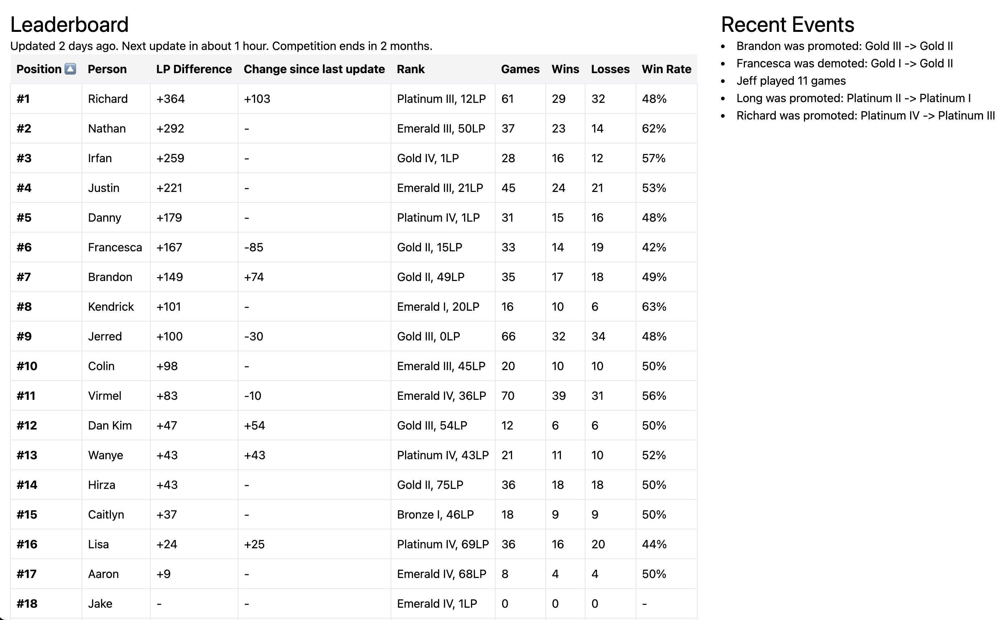

# Glitter Boys

This repository contains projects related to a Discord server that I share with my friends.

It contains several projects:
* A bot that allows you to give "karma" to other users
* A bot that posts when friends enters matches of League of Legends complete with post-match reports and leaderboards posted to Discord
* A front-end that contains documentation and a leaderboard

