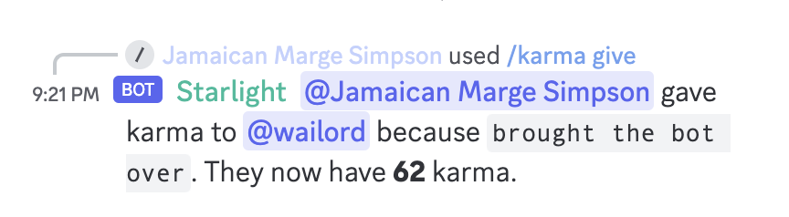

# Discord

This repository contains projects related to a Discord server that I share with
my friends.

It contains several projects:

- A bot that allows you to give "karma" to other users
- A bot that posts when friends enters matches of League of Legends complete
  with post-match reports and leaderboards posted to Discord
- A front-end that contains documentation and a leaderboard
- A small website for sharing knowledge and hosting events
- A bot that plays music in Discord

## League of Legends

> Messages are posted when someone enters a match of League of Legends.

> After a match is complete, an inline post-match report image is posted to
> Discord.

[The leaderboard site](./assets/leaderboard_site.png)

> The leaderboard site shows the status of competitions with sorting.

> A simpler leaderboard is also posted as a Discord message.

## Karma

> Karma is given with an optional reason

> Karma history is tracked

> A leaderboard shows who has the most karma
